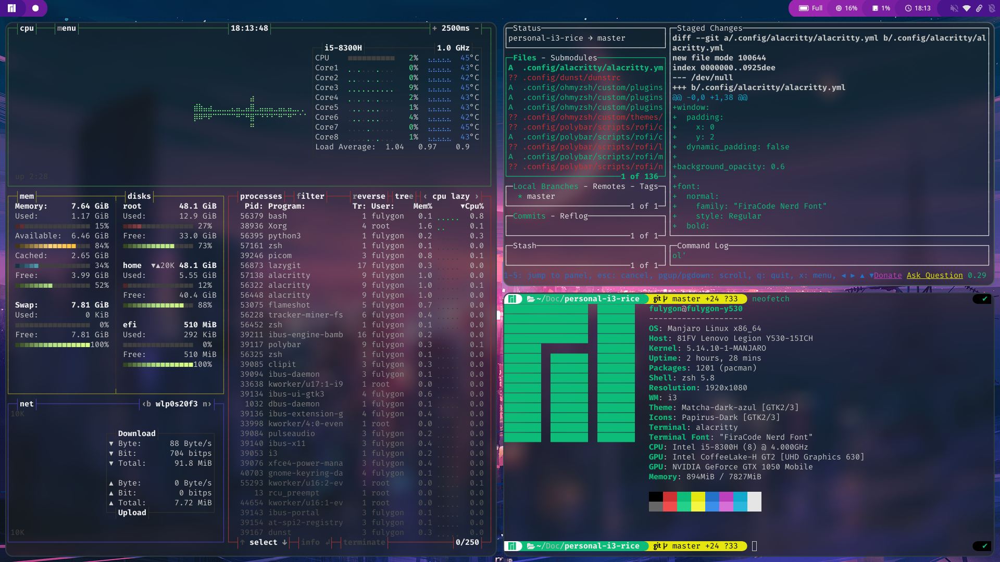
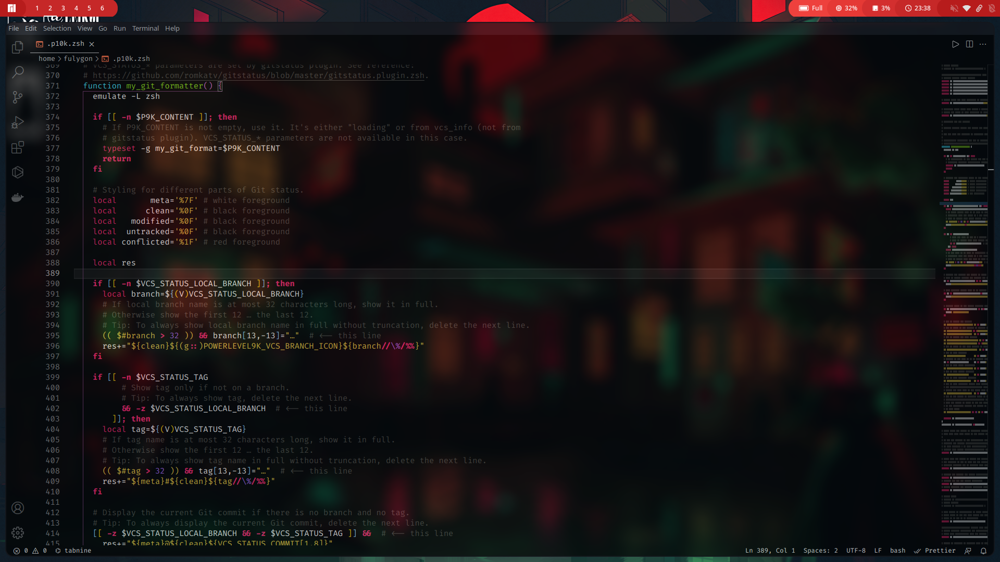
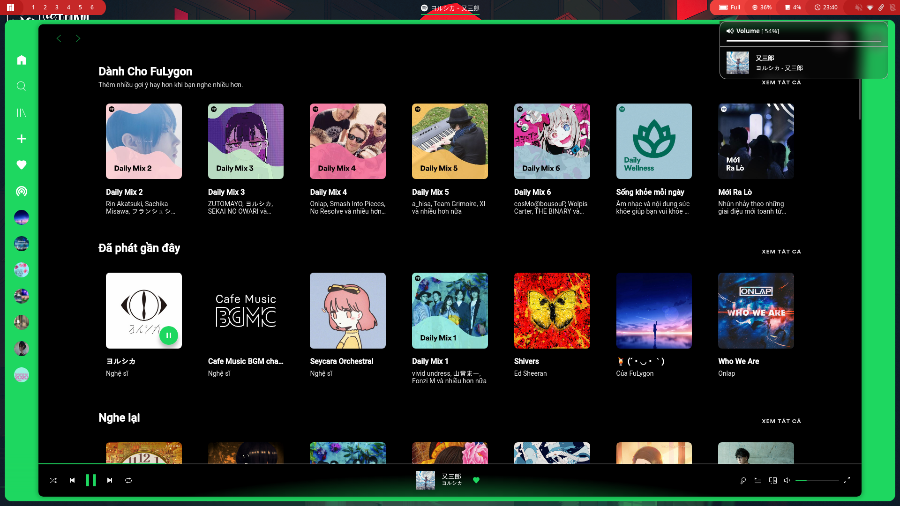
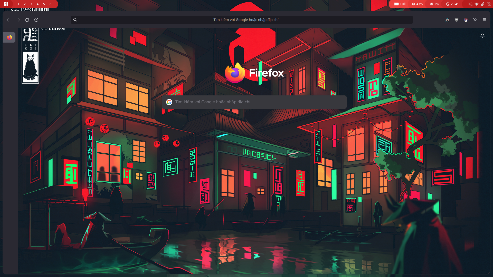

My personal i3 setup and dotfiles

# Dependencies

- [alacritty](https://github.com/alacritty/alacritty)
- [dunst](https://github.com/dunst-project/dunst)
- [i3-gaps](https://github.com/Airblader/i3)
- [lightdm](https://github.com/canonical/lightdm)
    - [lightdm-webkit2-greeter](https://github.com/Antergos/web-greeter)
- [ibhagwan's picom fork](https://github.com/ibhagwan/picom)
- [polybar](https://github.com/polybar/polybar)
- [rofi](https://github.com/davatorium/rofi)
- [zsh](https://github.com/zsh-users/zsh)
    - [ohmyzsh](https://github.com/ohmyzsh/ohmyzsh)
    - [powerlevel10k](https://github.com/romkatv/powerlevel10k)
    - [zsh-autosuggestions](https://github.com/zsh-users/zsh-autosuggestions)
    - [zsh-syntax-highlighting](https://github.com/zsh-users/zsh-syntax-highlighting)

### Optional

- [exa](https://github.com/ogham/exa) (better ls)
- [flameshot](https://github.com/flameshot-org/flameshot)
- font (needed if you don't plan to modify my alacritty, dunst and polybar config)
    - [FiraCode & Iosevka Nerd Font](https://github.com/ryanoasis/nerd-fonts)
    - [Font Awesome](https://github.com/FortAwesome/Font-Awesome)
- [gotop](https://github.com/cjbassi/gotop)
- [lazygit](https://github.com/jesseduffield/lazygit)
- [personal firefox css](https://github.com/FuLygon/personal-firefox-css)
- [playerctl](https://github.com/altdesktop/playerctl)
- spotify
    - [spicetify-cli](https://github.com/khanhas/spicetify-cli)
    - [Dribbblish theme](https://github.com/morpheusthewhite/spicetify-themes)
- vscode
    - [Styrokai++ theme](https://marketplace.visualstudio.com/items?itemName=kepler0.styrokai-plusplus)
    - [Material icon](https://github.com/PKief/vscode-material-icon-theme)

# OS Info

- **Distro**: Manjaro i3 community
- **Shell**: zsh
- **Window Manager**: i3-gaps
- **Display Manager**: lightdm
- **Terminal**: alacritty
- **Compositor**: ibhagwan's picom fork
- **Status Bar**: polybar
- **Launcher**: rofi
- **Notification**: dunst

# Installation
```bash
$ git clone https://github.com/FuLygon/personal-i3-rice.git
$ cd personal-i3-rice
$ chmod +x install.sh && ./install.sh
```
**Note:** the installation script only install the config files, it won't install dependencies.

# Screenshots





